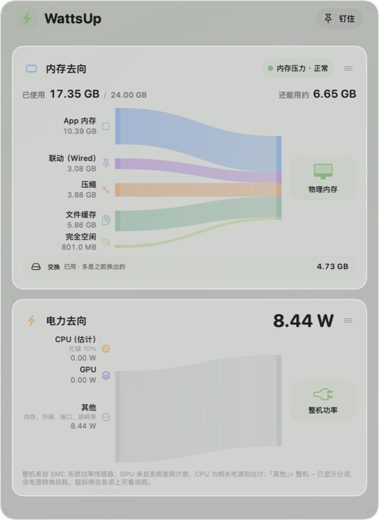

# WattsUp

[English](README.en.md)

macOS 菜单栏小工具，用桑基图（流向图）显示这台 Mac 的**电都花在哪**、**内存都被谁占着**。为台式 Apple 芯片 Mac 设计，在 Mac mini（M6）/ macOS 27 上开发。



**下载**：到 [Releases](https://github.com/Mikey-Cai/WattsUp/releases/latest) 下载 zip，解压后把 WattsUp.app 拖进「应用程序」。App 没有经过苹果公证，第一次打开会被拦下，到「系统设置 → 隐私与安全性」里点「仍要打开」即可。需要 Apple 芯片 Mac、macOS 14 以上。下载版没有桌面小组件。

- **内存**：分成 App 内存、联动（Wired）、压缩、文件缓存、完全空闲五股，口径和活动监视器一致；顶上一行写「已使用 / 总量 · 还能用约多少」。鼠标停在「物理内存」「App 内存」「压缩」上，旁边列出占用最多的 10 个进程，鼠标可以移到列表上慢慢看。
- **内存余量**：按「还能用」占物理内存的比例亮灯——20% 以上「充足」，8%–20%「偏紧」（内存卡淡淡染黄），不到 8%「紧张」（染红），和旁边的数字说的是一回事。活动监视器里的「内存压力」看的是系统压缩、换出有多忙，可能和这里不一样，系统的判断放在悬停说明里。交换只显示已用量，并说明「余量充足时交换大多是之前换出的」。
- **内存读写速度**：从内存控制器的带宽统计（IOReport · PMP）推算所有部件合计的读写速度：按 4 GB/s 分档，取各档中点加权平均，分档本身的误差在 ±2 GB/s 以内。在 M6 上和两次压测对照，分别差 +9% 和 −2%（两次对照不代表通用精度）。最高一档上沿是 128 GB/s，按中点 126 算；落在最高档的时间超过 5% 时标「触及最高档 · 可能偏低」。读不到的机器不显示这一行。
- **功耗**：整机读数，加上能读到的分项。**读不到的不显示、也不画成 0**，「其他」= 整机 − 已显示分项。
- **面板**：挂在菜单栏图标下，可改宽高；钉住后留在原处、置顶，能拖到任何地方。两张卡片按住就能上下拖动换位。主题色、方向（总量在左/右）、刷新间隔可调。
- **桌面小组件**（需要自己签名，见下文）：小号显示整机功耗和内存，中号再加 CPU、GPU、交换。
- 只用系统框架，**不联网**，不收集任何数据。

## 功耗读数从哪来

在 M6 + macOS 27 上实测：

| 分项 | 来源 | 说明 |
|---|---|---|
| 整机 | AppleSMC `PSTR`（系统功率传感器） | 没有拿插座功率计核对过，不等于墙上实测 |
| GPU | IOReport「GPU Energy」能量差 ÷ 时间 | 和 `powermetrics` 交叉核对过，量级一致 |
| CPU（估计） | AppleSMC `PP0b` | 跟着 CPU 负载变化（空闲约 2.5 W，满载多约 10 W），GPU 跑满时不涨，所以和 GPU 不重复计算；苹果没公开它具体管哪些电路，所以标「估计」。下面附 CPU 忙碌度 |
| 其他 | 整机 − 上面的分项 | 内存、存储、接口芯片、电源转换损耗和测量误差 |

神经网络引擎（ANE）和内存（DRAM）在这一代机器上没有可用的功耗计数，`powermetrics` 也读不到，所以不显示。别的同类工具在 M5 + macOS 27 上也报告了同样的情况。

传感器状态分三种：这台机器从来没读到过的，直接隐藏；读到过但这一次读失败，写「读取失败」；数值长时间一动不动，写「数据未更新」，不画进图里。某一帧分项加起来超过整机时，先撤掉不太可靠的 CPU 估计，绝不按比例缩放成「看起来对」的拆分。

内存口径的推导见 [docs/memory-methodology.md](docs/memory-methodology.md)。

## 构建

需要 macOS 14 以上和 Xcode（命令行工具）。没有第三方依赖。

```sh
git clone https://github.com/Mikey-Cai/WattsUp.git
cd WattsUp
./scripts/test.sh
./scripts/build.sh
open build/WattsUp.app
```

什么都不配置时，App 用临时签名（ad hoc），**不带桌面小组件**，其他功能完整。

### 想要桌面小组件

小组件和主 App 通过 App Group 共享数据，App Group 要用你自己的 Team ID。设置这两个变量（写在环境变量里，或者新建 `scripts/local.env`，这个文件不会被 git 收录）：

```sh
WATTSUP_SIGN_IDENTITY="Apple Development: you@example.com (XXXXXXXXXX)"   # 或证书的 SHA-1
WATTSUP_TEAM_ID=ABCDE12345                                               # 证书里的 OU（组织单位）
```

可以用 `security find-identity -v -p codesigning` 找到证书。之后再运行 `./scripts/build.sh`，App Group 是 `<Team ID>.io.github.mikey-cai.wattsup`。

把 `WattsUp.app` 拷进「应用程序」文件夹再打开一次，然后在桌面空白处右键 →「编辑小组件」，搜索 WattsUp。放在别的文件夹里时，系统可能不在小组件库里列出它。

签名故意不加 hardened runtime（`-o runtime`）。主 App 不沙盒（读 AppleSMC 和 IOReport 需要），只声明 App Group；小组件扩展按 WidgetKit 要求沙盒化，只读共享容器里的一个小 JSON。

## 命令行

```sh
WattsUp.app/Contents/MacOS/WattsUp --dump-json         # 采样一次，打印全部读数（缺失字段 = 未知，不是 0）
WattsUp.app/Contents/MacOS/WattsUp --probe             # 只读枚举全部 SMC 键
WattsUp.app/Contents/MacOS/WattsUp --processes         # 内存 / 压缩内存前 10 的进程
WattsUp.app/Contents/MacOS/WattsUp --measure-overhead  # 采样本身占多少 CPU
WattsUp.app/Contents/MacOS/WattsUp --widget-snapshot   # 写一次小组件数据
WattsUp.app/Contents/MacOS/WattsUp --cross-check-gpu   # 和 powermetrics 对照 GPU（需要下面的可选助手）
python3 scripts/calibrate2.py                          # 分阶段标定：空闲、CPU、GPU、内存带宽、磁盘
```

`helper/` 里有一个**可选**的 root 助手：只在 WattsUp 请求时跑一次 `powermetrics`，用来交叉核对 GPU 读数。App 平时不需要它。安装：`sudo zsh helper/install.sh`；卸载：`sudo zsh helper/install.sh --uninstall`。

## 代码结构

```text
Sources/WattsUpCore       纯逻辑：内存口径、桑基布局、功耗分项、传感器状态、卡片换位、面板几何、小组件快照
Sources/CSensors          AppleSMC / IOReport（能量计数与状态直方图）的 C 接口
Sources/WattsUpHardware   采样：功耗、内存、内存带宽、CPU 忙碌度、进程内存
Sources/WattsUp           菜单栏面板、SwiftUI 界面、悬停进程列表、采样调度
Sources/WattsUpWidget     WidgetKit 桌面小组件（build.sh 手工打包成 .appex）
Tests/WattsUpCoreTests    单元测试
```

## 注意

AppleSMC 和 IOReport 都不是稳定公开的接口，系统升级可能让某个读数消失或改变含义。WattsUp 的原则是读不到就说读不到，不猜。

MIT 许可，见 [LICENSE](LICENSE) 与 [THIRD_PARTY.md](THIRD_PARTY.md)。
